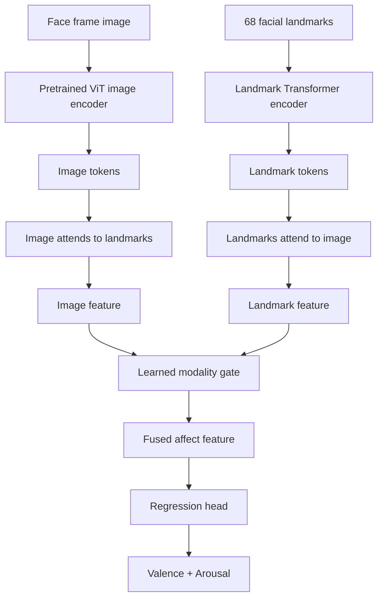

# ABAW 2026 Research Project

This repository starts from a prototype: a pretrained ViT encodes facial appearance, a Transformer encodes 68 facial landmarks, bidirectional cross-attention fuses both streams, and a regression head predicts valence and arousal.

The current AFEW-VA subset contains 50 videos and 2,381 annotated frames. Its labels are in `[-10, 10]`; the loader scales them to `[-1, 1]` to match Aff-Wild2 and the model's bounded output.

## High-level architecture 


## Setup

```bash
/opt/homebrew/bin/python3.12 -m venv .venv
source .venv/bin/activate
python -m pip install --upgrade pip
python -m pip install -e .
```

The first run downloads the pretrained ViT weights from Hugging Face.

## Sanity Check

```bash
abaw-smoke --config configs/baseline.yaml
```

Expected tensor shapes are image `(3, 224, 224)`, landmarks `(68, 2)`, and prediction `(1, 2)`. The prediction is random before training.

## Train

```bash
abaw-train --config configs/baseline.yaml
```

The split is made by video rather than frame, preventing neighboring frames from the same clip leaking into validation. The best checkpoint is written to `outputs/baseline/best.pt`.

## What Is Implemented Now

This project currently implements a frame-level valence/arousal baseline:

1. Load AFEW-VA image frames, 68 facial landmarks, and valence/arousal labels.
2. Resize and normalize each image frame.
3. Normalize landmark coordinates so the model focuses on face shape rather than absolute image position.
4. Encode the image with a pretrained ViT backbone.
5. Encode landmarks with a small Transformer encoder.
6. Fuse image and landmark features with bidirectional cross-attention.
7. Learn a modality gate that chooses how much to trust the image feature versus the landmark feature.
8. Predict valence and arousal in the normalized `[-1, 1]` range.
9. Train with a hybrid CCC and MSE loss.
10. Save the best validation checkpoint to `outputs/baseline/best.pt`.

The current code does not yet include expression classification, action unit detection, or multi-task learning heads.

## File Guide

- `configs/baseline.yaml`: stores dataset, model, and training settings.
- `src/abaw/data.py`: loads frames, landmarks, and labels from the dataset.
- `src/abaw/model.py`: defines the ViT + landmark Transformer fusion model.
- `src/abaw/losses.py`: defines CCC and the hybrid VA training loss.
- `src/abaw/smoke_test.py`: runs one sample through the model to verify setup.
- `src/abaw/train.py`: trains the baseline model and saves the best checkpoint.
- `pyproject.toml`: defines package dependencies and terminal commands.

## Current Limitations

- The model sees one frame at a time, not a video sequence.
- The current dataset is small and should be used mainly to validate the pipeline.
- The pretrained ViT image encoder is frozen by default for faster local experimentation.
